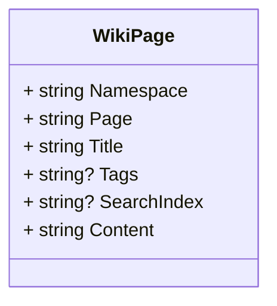

# Data Model

## Wiki Model

The WikiPage model is a multi-tenant entity designed to store and manage wiki-like content within the application. Each wiki page contains various fields essential for organizing, categorizing, and displaying content efficiently. This model supports multi-tenancy, allowing different tenants or customers to have their own set of wiki pages, enhancing content management and search functionality across the application.

Key attributes include:

- **Namespace**: Defines the category or group a page belongs to, such as user guides or admin documentation, providing structure to the content.
- **Page**: The unique path for accessing the page on the web, facilitating easy navigation.
- **Title**: A brief, descriptive label that summarizes the page content.
- **Tags**: Optional keywords that help categorize and group pages for easier searchability.
- **SearchIndex**: A field optimized for storing normalized and concatenated values to enhance search capabilities.
- **Content**: The actual body of the page, stored in Markdown format to allow rich text formatting and display.

