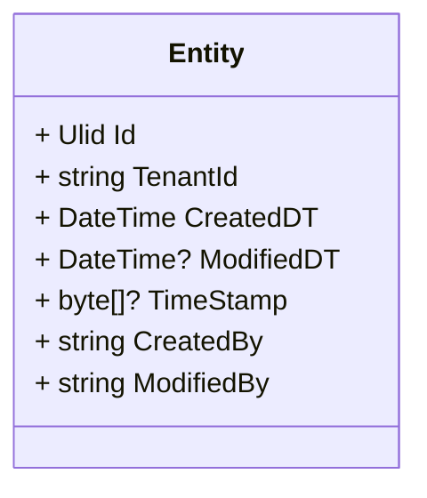

# Data Model

The data model of an application defines how data is structured, stored, and related within the system.

## Base Model

In this app, the core data entities reflect common elements found in many web applications:

**Entity:** Represents a generic object in the system. Each entity has:

- Id: A unique identifier (Ulid) that ensures each entity can be referenced uniquely.
- TenantId: A string that identifies the tenant or customer in a multi-tenant system, helping to segregate data by tenant.
- CreatedDT and ModifiedDT: Timestamps representing when the entity was created and last modified, supporting audit trails.
- TimeStamp: An optional byte array, often used for concurrency checks or versioning.
- CreatedBy and ModifiedBy: Strings representing the users responsible for creating and modifying the entity, ensuring traceability of changes.
