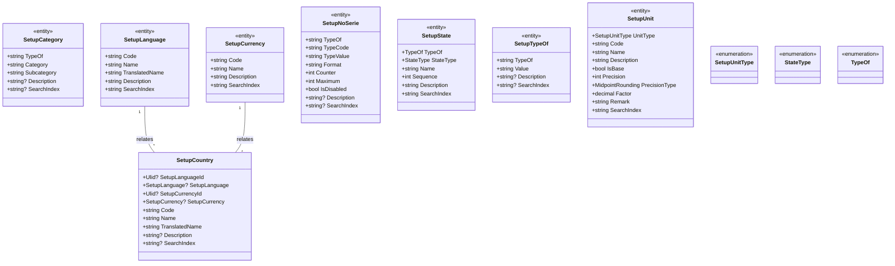

# Data Model

## Setup Model

The setup data model defines a foundational framework for managing essential configuration entities such as countries, currencies, languages, states, and measurement units. This model provides structure and organization, ensuring that the relationships and dependencies between these entities are properly captured and maintainable. By centralizing this data, it supports broader system configurations and ensures that necessary parameters are available for various operational workflows and processes.

**SetupCategory:** serves as a lookup for defining and managing categories and subcategories. It allows users to categorize objects effectively, enhancing organization and searchability. Each category can have one or more subcategories that relate to the selected category, enabling a hierarchical structure for data management.

**SetupCountry:** Represents a country and is linked to specific languages and currencies. It includes information such as country code, name, translated name, and an optional description.

**SetupCurrency:** Stores details about the available currencies within the system, including the currency code, name, description, and search index.

**SetupLanguage:** Defines the languages available in the system, including the language code, name, translated name, description, and search index.

**SetupNoSerie:** class is responsible for defining numbering series for generating sequential numbers tailored for various entities in a multi-tenant system. This class provides flexibility in number generation while ensuring that each type and value combination can have its own series with a specific format.

**SetupState**: Represents a specific state within the system's operational context. This entity includes attributes like object type, state type, name, sequence, and description.

**SetupTypeOf:** class defines a specific type or classification for an object and can be used to categorize various objects within the system. It includes fields that help to manage and configure different object types and their corresponding values, allowing for efficient organization and retrieval.

**SetupUnit:** Contains details about units of measurement, including their types, codes, precision, and related remarks. It also defines whether the unit is a base unit.

**SetupUnitType:** An enumeration that specifies the type of unit being used, for example, length, weight, or volume.

**StateType:** An enumeration representing the various types of states (e.g., operational, geographical).

**TypeOf:** An enumeration that defines the type of object being represented in the system (e.g., product, service).