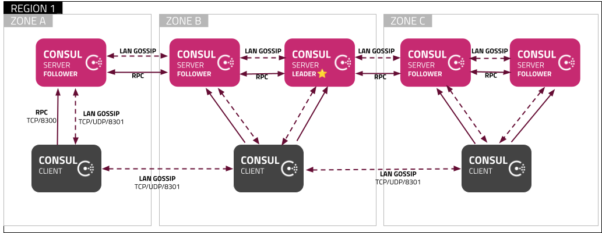

# Consul

aka consul

Consul is an open-source tool by HashiCorp designed for service discovery, configuration management, and network automation within distributed systems. It helps applications and services communicate seamlessly across diverse environments, such as cloud, on-premises, or hybrid infrastructures. Consul provides key features, including service discovery (to find and connect services dynamically), health checking (to monitor service availability), a distributed key-value store (for configuration), and network segmentation (with service mesh capabilities to secure and manage network traffic). Consul's adaptability makes it valuable for managing microservices and complex, dynamic environments efficiently.
